 

# Meditate With Alfred

Meditate With Alfred is a website for anyone and everyone who would like to meditate. Whether they are brand new to practicing meditation or a more experienced meditator, this site offers infomation for people to join Alfred in group meditations whether online or locally, in Cologne, Germany. You can visit the site [here](https://alfreda93.github.io/meditate-with-alfred/)

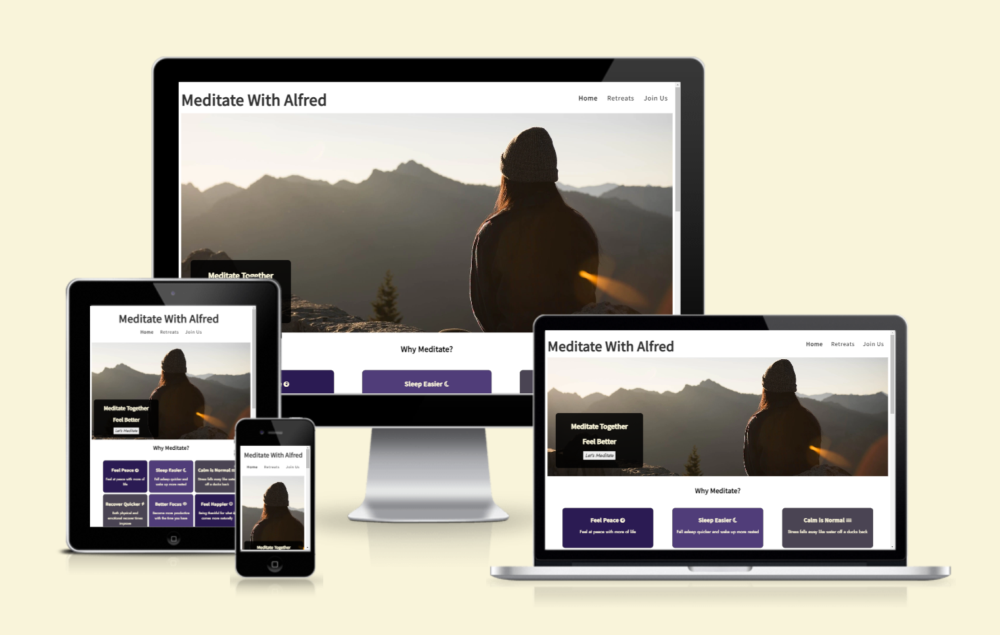

## Features 
------

- **Navigation Bar**
    - The navigation bar is presented on the top of the site of users to easily select which page they'd like to access, this is consistent throughout all 4 pages of the site.
        - Logo - takes the user to the Home Page, where they can see why, how and when Alfred and the group meet up to practice.
        - Home - takes the user to the Home Page, where they can see why, how and when Alfred and the group meet up to practice.
        - Retreats - takes you to the retreats page, where users can learn about what happens on Meditate With Alfred Retreats and see a gallery of past retreats. This is also where returning visitors can check for updates regarding future retreats.
        - Join Us - takes the user to a form page where they can register their interest in participating in group meditations and receive a free meditation as a thank you for filling in the form.
    - These links have an animated <b>bold</b> affect when the mouse is hovered over the top of each.

        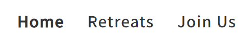

- **The Landing Page/Hero Image**
    - The landing page includes a photo to clearly set the peaceful tone that the aim of this website creates.
    - Overlayed the Hero Image is a call to action text with interactive button.
    - The interactive button takes the user through the Join Us page, where they can fill in user information and receive a free meditation as a thank you.

    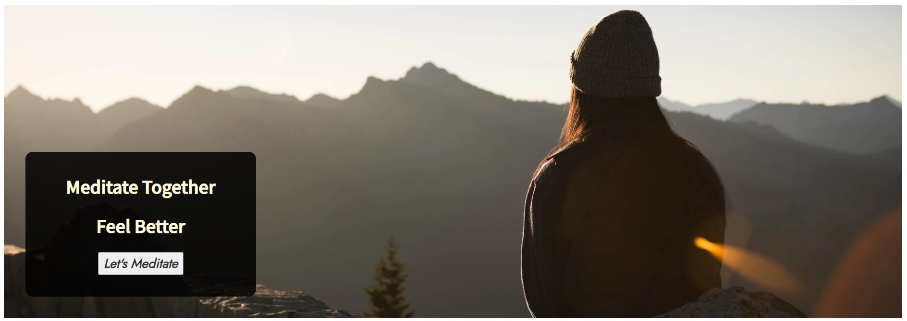

- **Why Meditate? Section**
    - This section of the home page should clearly express the benefits of practicing meditation.
    - The user should feel gently encouraged to join the group for meditation practice.

    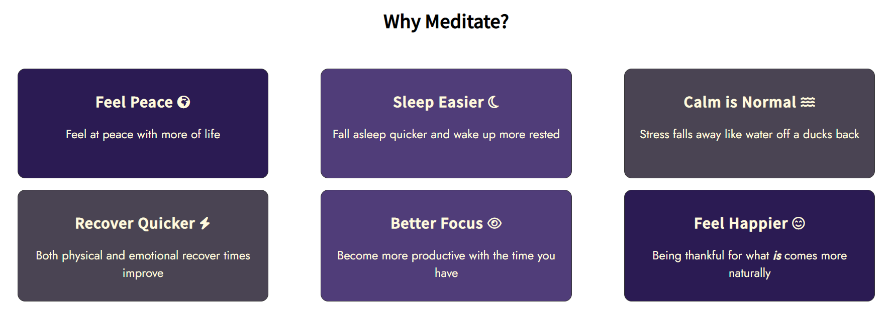

- **Let's Meditate section**
    - This section shows the user when they can join in with group meditations.
    - It should show the user that it doesn't matter where they are, they can participate from anywhere on the globe.

    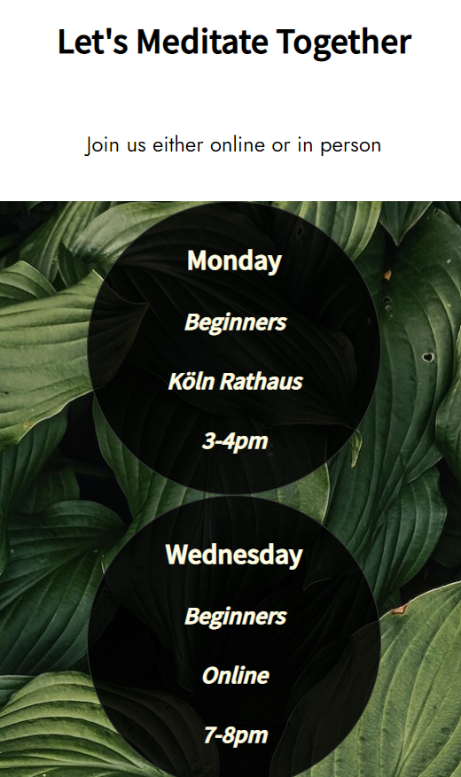

- **Footer**
    - The footer section includes links to YouTube and LinkedIn social links for the user to connect with the group and Alfred, the meditation teacher across different platforms.
    - This section is consistent across all pages, so the user can easily locate a way to connect over Social Media platforms. 
    - The footer also includes a Copyright logo which helps to give the user confidence that the business is professional and legitimate.

    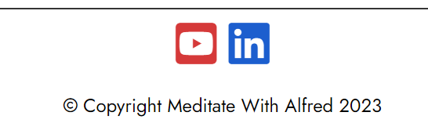

- **Retreats Page**
    - This page gives the user information about the retreats held and if there is any upcoming retreats, they will appear on this page.
    
    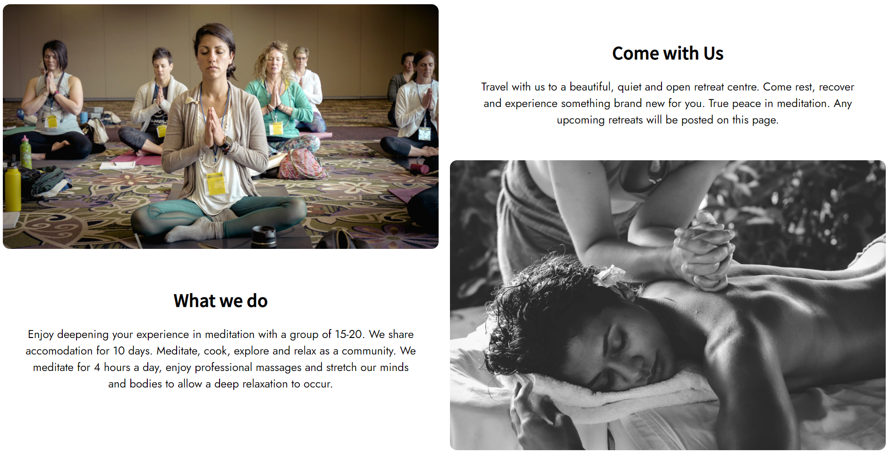

    - This page also includes a **Gallery** where users can see examples of what happens on retreats.
    - The user should feel excited and further encouraged to participate with Meditate With Alfred in retreats.

    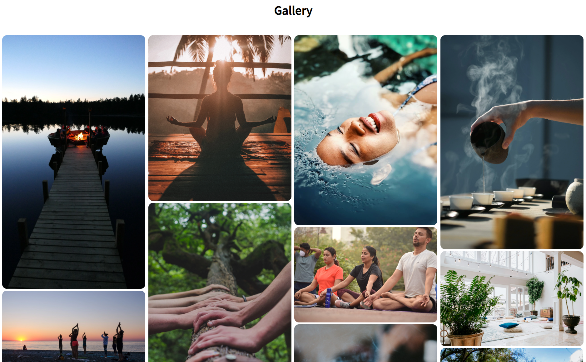

- **Join Us page**
    - This page has an interactive **form** where the user can share their information in return for a free meditation. They are asked for their name, email and whether they're interested in online, in person or retreat meditations.
    - The user should feel motivated to fill in the form. 

     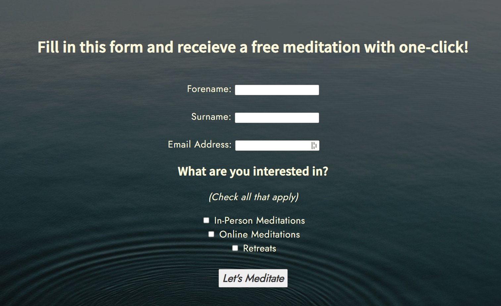

- **Thank You page**
    - This page has an embedded **YouTube video**. This is a free 15 minute meditation for the user, as a thank you for registering their details with Meditate With Alfred.
    - The user should feel appreciated and welcomed to the Meditate With Alfred website and excited to receive an email from the Meditate With Alfred team.

     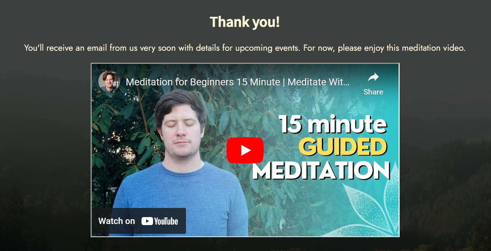

### **Potential Future Features**
- Add a members area for subscription based users. Here there would be exclusive meditations, Q&A's with Alfred and more ways to experience community within Meditate With Alfred.

## Design
------
I found inspiration for this website from YouTube and Find What Feels Good community Yoga Teacher Adrienne at her website [Find What Feels Good](https://fwfg.com). Wireframes for the design are at the bottom of this README.

The colour palette for Meditate With Alfred was intended to be peaceful and welcoming, with consistent design across all pages. The colours were found on on the website [mycolor](https://mycolor.space/)

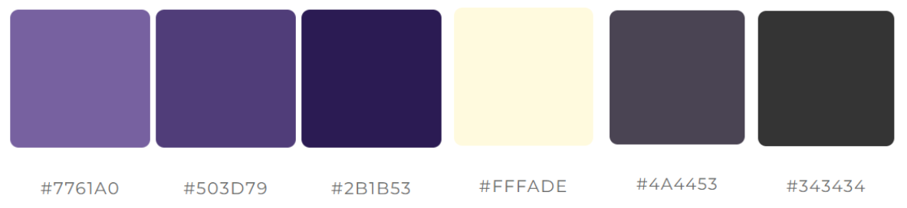

## Testing
------
- I checked the website for responsive design, accessibility and performance on browsers:
    - Chrome
    - Firefox
    - Brave
### **Validator Testing**
- **HTML**
    - [W3C HTML Validator](https://validator.w3.org/#validate_by_uri+with_options) has confirmed Meditate With Alfred has 0 errors.

     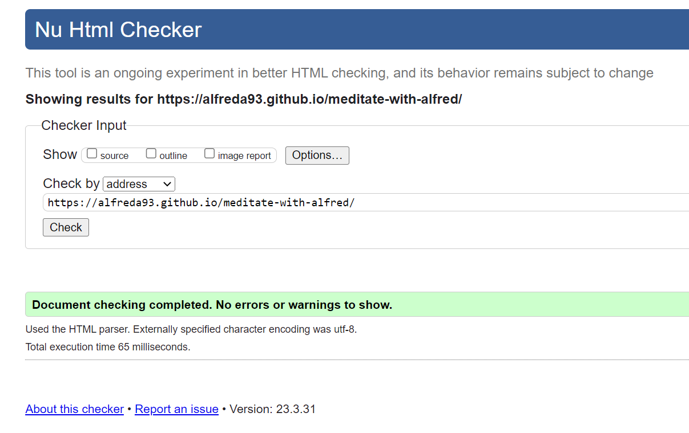
     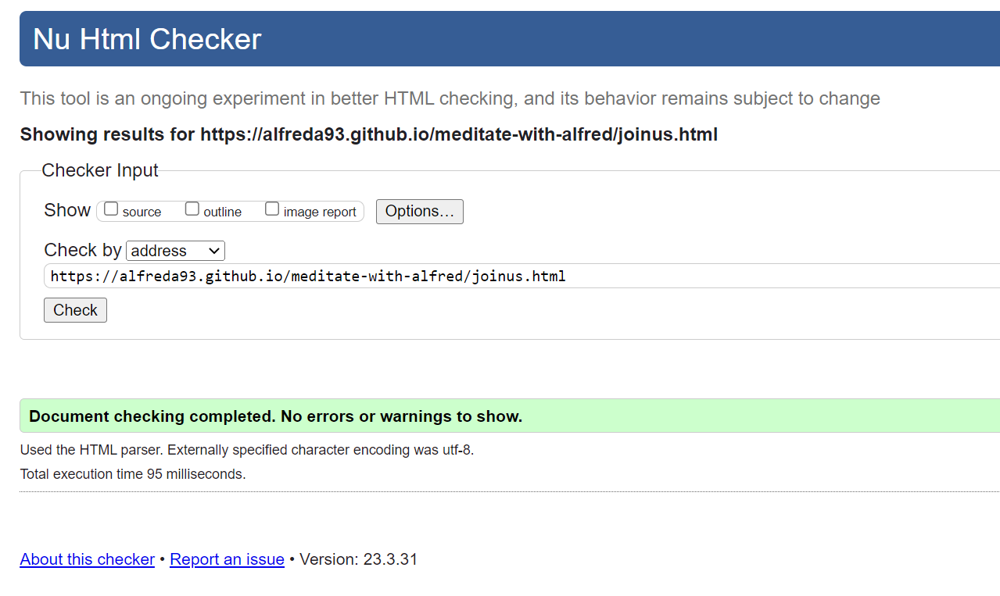
     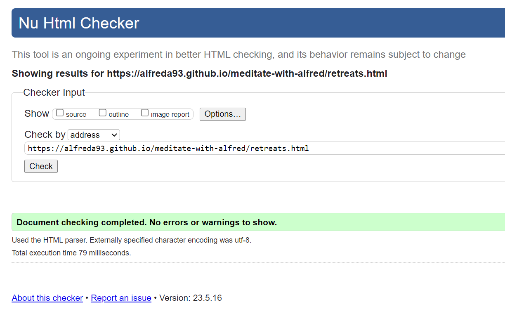
     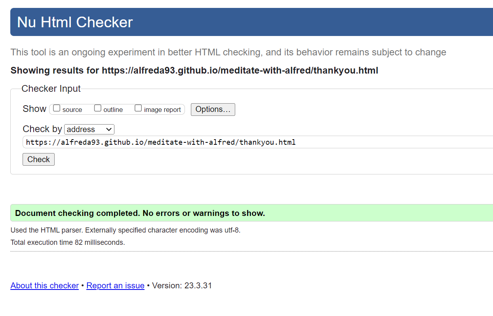

- **CSS**
    - [W3C CSS Jigsaw Validator](https://jigsaw.w3.org/css-validator/) has confirmed Meditate With Alfred has 0 errors.

    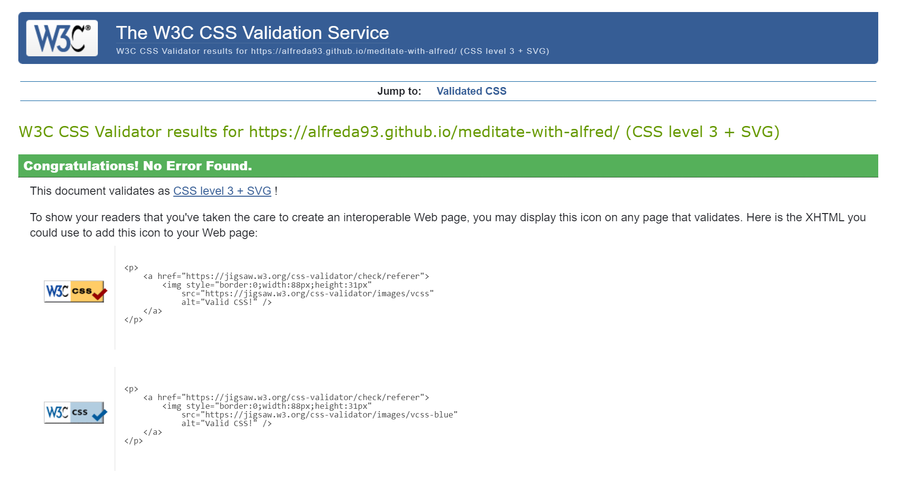

- **Lighthouse**
    - Developer Tools Lighthouse Accessability Checker gave Meditate With Alfred 100 on Performance, Accessibility, Best Practices and SEO

    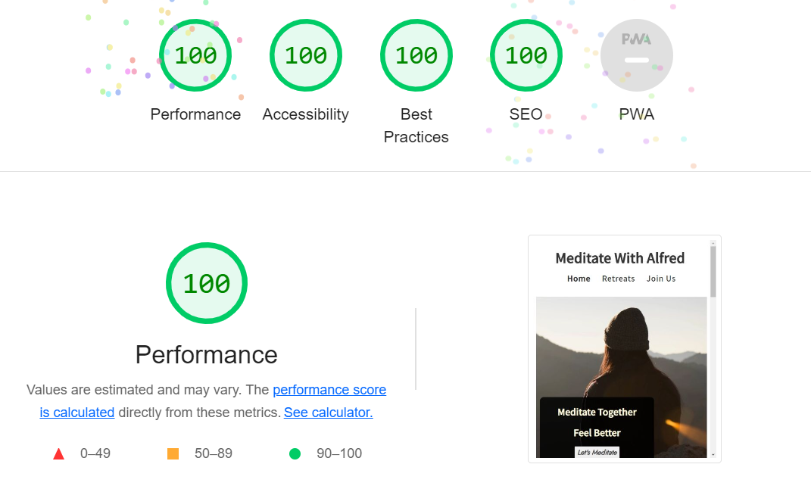

### **Responsiveness**
- I tested the responsiveness of Meditate With Alfred using the developer tools of my browser and changing the screen size to fit each major device. I also dragged the screen from wide to skinny so make sure that all common device sizes are covered. 

- To make sure Meditate With Alfred is accessible to all devices I added Media Queries and associated styling for the following sizes:
    - 2K+ Screens (1440px minimum width)
    - Tablets (900px max width)
    - Medium to large phones, inluding foldable phones. (800px max width)
    - Smaller phones eg. iPhone SE (525px max width)
    - Very small screens (300-375px width)

### **Bugs**

- Problem: After changing the image path when converting images from jpeg to webp, images do not show.
    - *Solution: incorrect file type was written. Update to .webp from .jpeg*

- Problem: Hero image text not appearing on top of hero image
    - *Solution: Set the `position` of hero image text to `absolute`*

#### **Unfixed Bugs**

- None

## Mistakes
------

Throughout the process of writing the code of this website. A few mistakes were made.
- A few of the first commits were over the 50 character max length.

     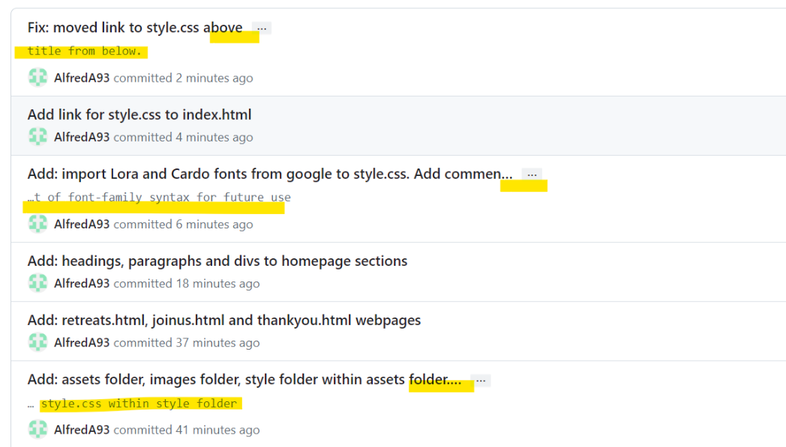

*Solution: I adapted my commits to be shorter.*

- A few times I forgot to save before processing `git add` and `git commit`, so not all edits were included as intended.

*Solution: When this happened, I often noticed immediately, so I sent the same `git commit -m "    "` commit message twice in a row, so this would be covered.*

- When writing `git commit`'s for this README documentation, I accidently typed in the past tense.

*Solution: I noticed this within 2 commits and went back to the usual present tense*

- When adding documentation images to folder, I commited with a message on Media Screen Styling and forgot to add note on image add.
*Solution: I noticed immediately and added a note with the next commit. Only `git add assets/css/style.css` instead of `git add .` which adds everything, not just one file at a time*

### **Mistakes Conclusion**

I learnt alot throughout the making of this website, especially regarding git commit's. This was a valuable lesson to learn and potentially to be expected being new to Git and GitHub. I remain humbled by how easy it is to make such a simple mistake and this experience during the process of making this website helped me to stay focused and aware of what I enter between commit's and saves. 

## Deployment
------
Meditate with Alfred was deployed onto GitHub Pages. Here are the steps to deploy this website:

- Within the repository name of the project (meditate-with-alfred), go to the ***Settings*** tab
- On the left hand menu, under ***Code and automation*** subtitle see ***Pages***
- Under ***Build and deployment*** and ***Branch*** choose ***Main***, click Save.
- This page will then refresh and the name of the website with live link will be available within a few minutes.
- Find this link [here](https://alfreda93.github.io/meditate-with-alfred/)

## Credits 
------
### **Content**

- The code for embedding the YouTube video on the Thank You page was taken from the share button on this [video](https://www.youtube.com/watch?v=Wy1KXcRBV2c)

- The icons used are from the site [FontAwesome](https://fontawesome.com/)

- Fonts were installed using `@import` code from [Google Fonts](https://fonts.google.com/)

- Favicon Icon used to give the tab an icon was sourced from [favicon.cc](https://www.favicon.cc/?action=icon&file_id=941316)

- [Sticky Footer](https://philipwalton.github.io/solved-by-flexbox/demos/sticky-footer/) code was from Solved by Flexbox website by hilip Walton - I adapted it to suit Meditate With Alfred.

### **Helpsheets and Learning Resources**

Throughout writing the code, I looked over learning resources and helpful videos to inspire and understand the syntax of the code with greater clarity. These are as follows -
- [Flexbox](https://css-tricks.com/snippets/css/a-guide-to-flexbox/) concepts from CSS Tricks website
- YouTube [video](https://www.youtube.com/watch?v=phWxA89Dy94) explaining Flexbox.
- W3 School website for [CSS Buttons](https://www.w3schools.com/css/css3_buttons.asp)
- [Stack overflow](https://stackoverflow.com/questions/24837102/the-element-button-must-not-appear-as-a-descendant-of-the-a-element) helped me understand why the element button must not appear as a descendant of the a element.

### **Media**

- All images were sourced from [Unsplash](https://unsplash.com/)

- The images were then converted into webp file type using [freeconvert](https://www.freeconvert.com/webp-converter/)

- The wireframes were made using [wireframe.cc](https://wireframe.cc) and [Adobe Fresco](https://www.adobe.com/products/fresco.html) for iPad, which were drawn by myself.

- Colour Gradients/Palettes were found on the website [mycolor](https://mycolor.space/) 
## Wireframes
------
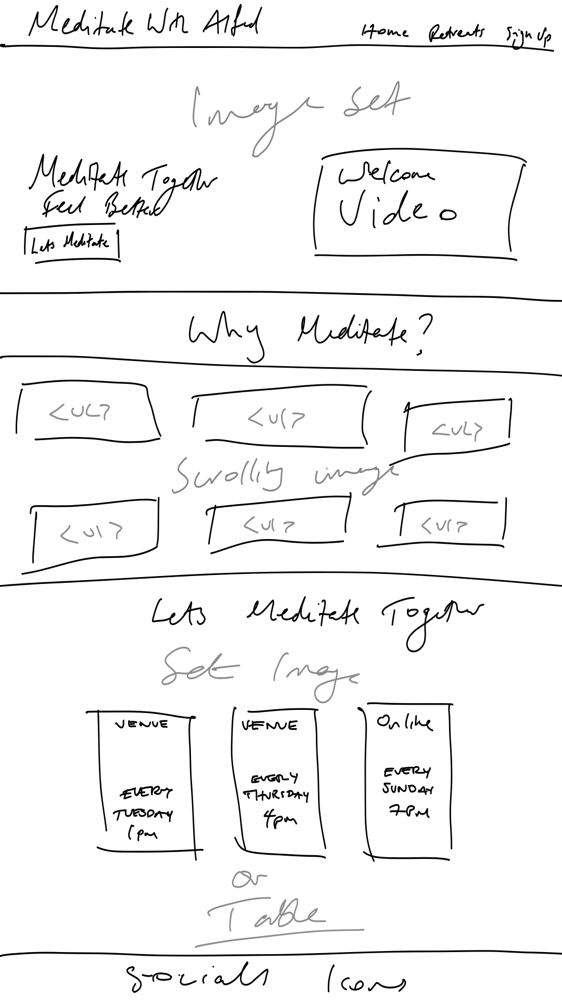
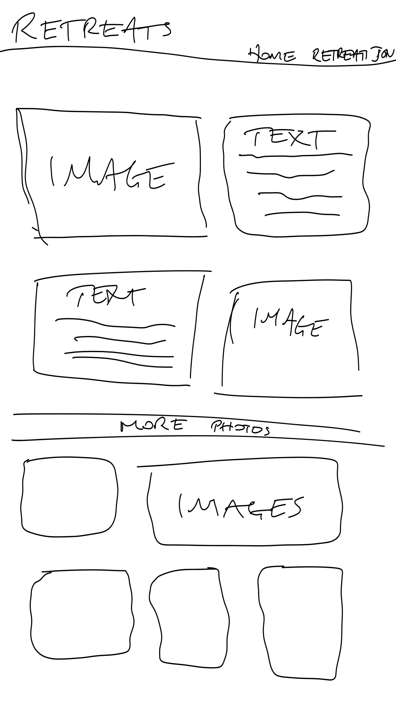
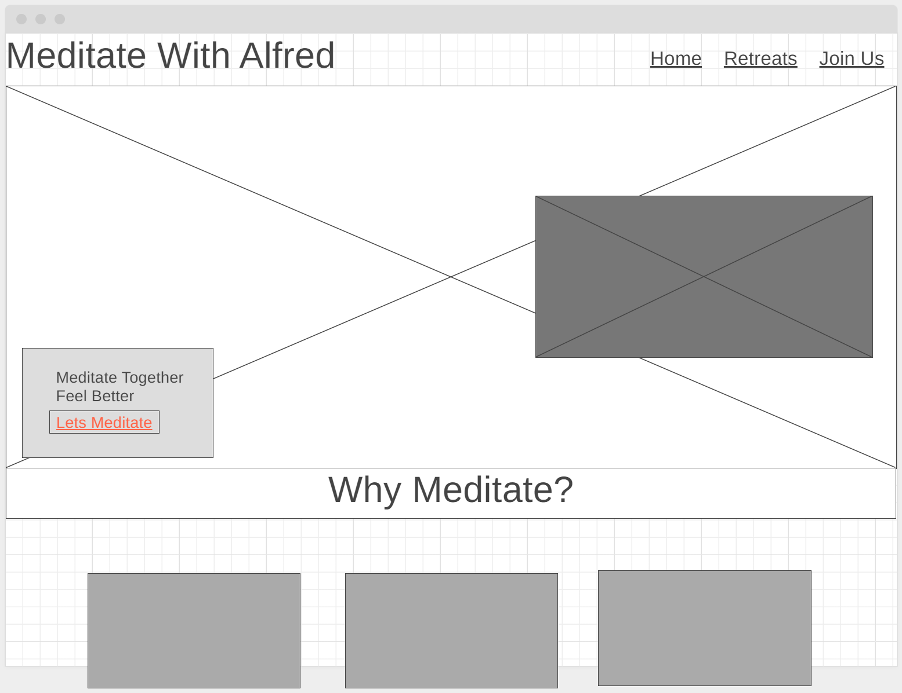